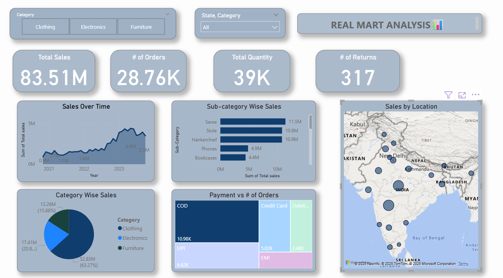

# Real Mart Sales Analysis Dashboard 🛒

## Overview:
This dashboard analyzes retail mart sales data including total sales, orders, product categories, and location-based performance. Designed using Microsoft Power BI, it helps visualize trends and support business decisions.

## Features:
- 📊 KPIs: Total Sales (83.51M), Orders (28.76K), Quantity (39K), Returns (317)
- 🕒 Sales Over Time (2020–2023)
- 📦 Category-wise & Sub-category Sales
- 🌍 Geo Map: Sales by Location
- 💳 Payment Method vs Orders (Tree Map)
- 🔎 Filters: Category, State

## Tools Used:
- Power BI
- Power Query
- DAX (Calculated Metrics)

## Dashboard Preview:

